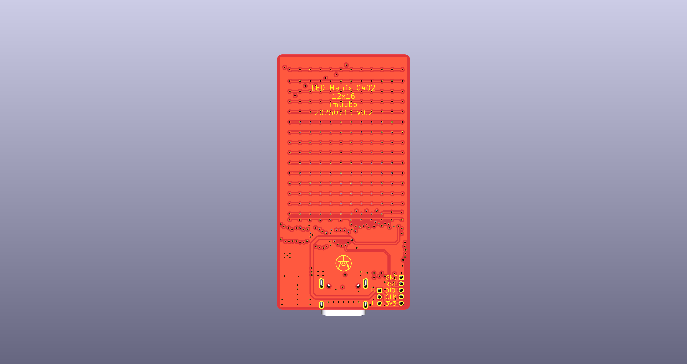

# LED-Matrix-12x16




## 简要说明

* KiCad版本是9.0.2
* 主控MCU是WCH的CH32V203C8U6
* LED的封装是0402, 一共192颗
* BOOT拉高进入USB下载模式, 可以不用WCH-Link
* 要调试可以用调试接口, 1.27mm间距

## 代码

模拟蜡烛效果目前效果还很差, 能搞好了再说吧 ==.

## wchisp

```bash
wchisp flash CH32V203-LED-Matrix-12x16.hex
```